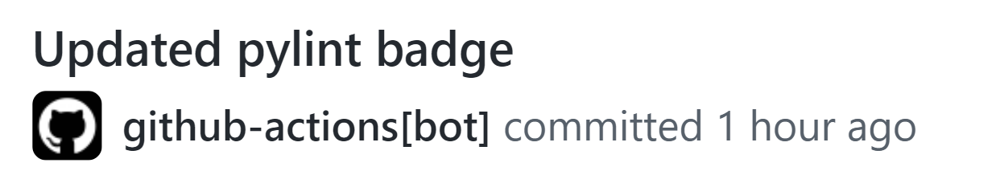

# PyLint with badge - GitHub Action

GitHub action that lets you *easily* lint **one** or **multiple** packages (or python files) of your project and adds a **dynamic badge**
to your `README.md` that lets you display the obtained score!

Each time the action is run, packages (or python files) specified will be linted and a badge in the `README.md` is updated dynamically
following one of the below rules:

|              Range PyLint score               |                                                           Badge                                                           |
|:---------------------------------------------:|:-------------------------------------------------------------------------------------------------------------------------:|
|      **Bad score**: *PyLint score* $< 5$      |     |
|  **Ok score**: $5 \le$ *PyLint score* $< 8$   |  |
| **Good score**: $8 \le$ *PyLint score* $< 10$ |  |
|   **Perfect score**: *PyLint score* $= 10$    |      |


You can fully customize the badge color of each of the above ranges! Check [usage](#usage) 
and [scenario](#scenario) sections for more!

The action can be triggered by a **`Pull request`**, a **`Push`** or manually with **`workflow_dispatch`**. 
If the score is changed, the `github_action` bot will change your badge with an automatic commit

* **IMPORTANT!** Follow the ['Preliminary steps' section](#preliminary-steps) in order to allow the bot to update your 
README.md with the pylint badge!


A quick example on how you would typically use this *action* (more examples in [scenario section](#scenario))
```yaml
- uses: Silleellie/pylint-github-action@v2.1
  with:
    lint-path: src  # lint src package
    python-version: 3.11  # python version which will lint the package
```

And after running the action, the *GitHub action bot* will update your PyLint badge with a commit:

<p align="center">
    
</p>

## Preliminary steps

To use this action you should perform two simple **first-time-only** operations:

1. In order to have a dynamic updated badge, before using for the first time this action, you should put a ***placeholder
badge*** in your `README.md` which will be substituted by the actual one as soon as you run this action.\
The placeholder badge should be in one of the following formats:
<p align="center"><b><code></code></b> or <b><code>[](https://redirect/link)</code></b></p>
<p align="center"><i>(The second format allows you to specify a link to which the user will be redirected after clicking on the badge)</i>

2. Be sure to set ***write permissions*** to GitHub actions in your repo settings!
You can change it in `Settings > Actions > General`, then go to subsection **Workflow Permissions** and thick the
***Read and write permission*** option

## Usage

```yaml
- uses: Silleellie/pylint-github-action@v2.1
  with:
    
    # Path of the package(s) or python file(s) to lint, relative to the repository root. 
    # If more than one package (or python file) should be linted, simply specify all of them 
    # with the multi-line notation like so:
    # lint-path: |
    #   src
    #   other_src
    #   main.py
    #   ...
    # 
    # Required
    lint-path: src
    
    # Version of the Python interpreter which will install all requirements of your project 
    # and lint the package(s) or python file(s) specified with the `lint-path` argument
    #
    # Required
    python-version: 3.9

    # Path of the requirements of your project, relative to the repository root. 
    # This can be easily changed in case you have `requirements-dev.txt`
    #
    # Optional, Default: requirements.txt
    requirements-path: requirements.txt
    
    # Path of the README.md to update with the pylint badge, relative to the repository root.
    #
    # Optional, Default: README.md
    readme-path: README.md
    
    # Path of the .pylintrc file containing custom lint rules to use, relative to the repository root.
    # In case it is not specified, the standard lint rules are used 
    #
    # Optional, Default: ''
    pylintrc-path: .pylintrc

    # Text to display in the badge
    #
    # Optional, Default: PyLint
    badge-text: PyLint

    # Color of the badge for pylint scores < 5.
    # Hex, rgb, rgba, hsl, hsla and css named colors can all be used
    #
    # Optional, Default: red
    color-bad-score: red

    # Color of the badge for pylint scores in range [5,8).
    # Hex, rgb, rgba, hsl, hsla and css named colors can all be used
    #
    # Optional, Default: orange
    color-ok-score: orange

    # Color of the badge for pylint scores in range [8,10).
    # Hex, rgb, rgba, hsl, hsla and css named colors can all be used
    #
    # Optional, Default: yellow
    color-good-score: yellow

    # Color of the badge for pylint scores == 10.
    # Hex, rgb, rgba, hsl, hsla and css named colors can all be used
    #
    # Optional, Default: brightgreen
    color-perfect-score: brightgreen
```

## Scenario

* [Single package to lint](#single-package-to-lint)
* [Single python file to lint](#single-python-file-to-lint)
* [Multiple packages to lint](#multiple-packages-to-lint)
* [Multiple python files to lint](#multiple-python-files-to-lint)
* [Mix packages and python files to lint](#mix-packages-and-python-files-to-lint)
* [Different path for requirements file](#different-path-for-requirements-file)
* [Different path for README.md file](#different-path-for-readmemd-file)
* [Specify custom .pylintrc filepath](#specify-custom-pylintrc-filepath)
* [Change badge text](#change-badge-text)
* [Change badge color with css named color](#change-badge-color-with-css-named-color)
* [Change badge color with hex code](#change-badge-color-with-hex-code)

### Single package to lint

```yaml
- uses: Silleellie/pylint-github-action@v2.1
  with:
    lint-path: src
    python-version: 3.11
```

### Single python file to lint

```yaml
- uses: Silleellie/pylint-github-action@v2.1
  with:
    lint-path: main.py
    python-version: 3.11
```

### Multiple packages to lint

```yaml
- uses: Silleellie/pylint-github-action@v2.1
  with:
    lint-path: |
      src
      app
      other_src/inner_src
    python-version: 3.11
```

### Multiple python files to lint

```yaml
- uses: Silleellie/pylint-github-action@v2.1
  with:
    lint-path: |
      file1.py
      file2.py
      other_src/file3.py
    python-version: 3.11
```

### Mix packages and python files to lint

```yaml
- uses: Silleellie/pylint-github-action@v2.1
  with:
    lint-path: |
      src
      app
      main.py
    python-version: 3.11
```

### Different path for requirements file

```yaml
- uses: Silleellie/pylint-github-action@v2.1
  with:
    lint-path: src
    python-version: 3.11
    requirements-path: requirements/requirements-dev.txt
```

### Different path for README.md file

```yaml
- uses: Silleellie/pylint-github-action@v2.1
  with:
    lint-path: src
    python-version: 3.11
    readme-path: models/README.md
```

### Specify custom .pylintrc filepath

With this parameter, you can easily adopt your custom lint rules when running this action! Start from the standard
one downloading it from [here](https://github.com/pylint-dev/pylint/blob/main/pylintrc) or by generating it
in on your own by running `pylint --generate-rcfile > .pylintrc` in your repository root

```yaml
- uses: Silleellie/pylint-github-action@v2.1
  with:
    lint-path: src
    python-version: 3.11
    pylintrc-path: .pylintrc
```

### Change badge text

```yaml
- uses: Silleellie/pylint-github-action@v2.1
  with:
    lint-path: src
    python-version: 3.11
    badge-text: alternative text
```

### Change badge color with css named color

In this case we are extending what we consider a perfect score: all scores in range $[8, 10]$ are considered
good enough and will have same color (*brightgreen*)

```yaml
- uses: Silleellie/pylint-github-action@v2.1
  with:
    lint-path: src
    python-version: 3.11
    color-good-score: brightgreen
    color-perfect-score: brightgreen
```

### Change badge color with hex code

In this example we are changing the color for the *bad score range* ( $[0, 5)$ ) to purple (hex code: *800080*)

```yaml
- uses: Silleellie/pylint-github-action@v2.1
  with:
    lint-path: src
    python-version: 3.11
    color-bad-score: 800080
```


## Credits

This is a composite GitHub action which uses the following godly working actions:

* [actions/checkout](https://github.com/actions/checkout)
* [actions/setup-python](https://github.com/actions/setup-python)
* [EndBug/add-and-commit](https://github.com/EndBug/add-and-commit)

Massive thanks to [shields.io](https://shields.io/), which is used to create the badge!
